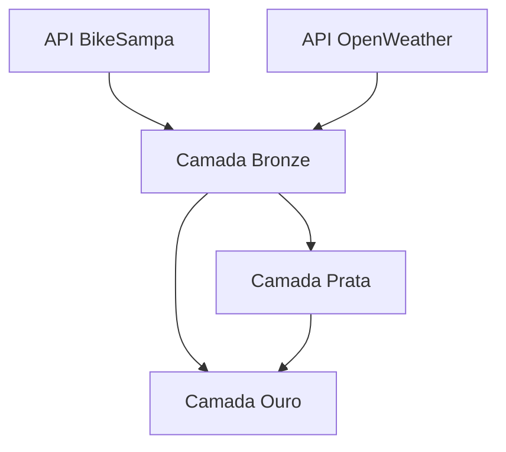

BikeSampaClima
Este projeto tem como objetivo coletar, processar e analisar dados de bicicletas públicas e clima da cidade de São Paulo. O fluxo de processamento de dados é organizado em jobs que executam as tarefas de forma sequencial, garantindo um processamento eficiente e estruturado das informações.
Como Usar no Azure Databricks
Para usar este projeto no Azure Databricks, siga os passos abaixo:

1. Configuração do Ambiente
Crie uma conta no Azure se ainda não tiver uma.

Crie um Workspace no Databricks: Acesse o Azure Databricks e crie uma instância do serviço no seu Azure Portal.

Criar 3 volumes para representar as camadas(bronze, prata, ouro).
Criar 1 volume de erros.

Configuração do Cluster:

Crie um cluster no Databricks com as configurações recomendadas para seu projeto (por exemplo, Python 3.x).

Após o cluster ser criado, inicie-o.

2. Carregar os Notebooks
Faça upload dos notebooks do projeto no Databricks.

Crie uma nova pasta no Databricks para organizar os notebooks.

Carregue cada notebook individualmente dentro dessa pasta.

3. Adicionar Dependências
Se você precisar instalar dependências como requests, adicione-as no seu notebook ou na configuração do cluster. Para isso, use o comando abaixo em um notebook:

python
Copy
Edit
%pip install requests

4. Executar os Jobs
   

Para rodar os jobs no Databricks:

Job 1 - Camada Bronze (Bike e Clima):

Execute o notebook correspondente para coletar e processar os dados das APIs.

Certifique-se de que os dados sejam salvos no formato Parquet na camada bronze.

Job 2 - Camada Prata (Clima):

Execute o notebook que processa os dados climáticos, realizando transformações e salvando na camada prata.

Job 3 - Camada Ouro (BikeClima):

Execute o notebook que integra os dados de bicicleta com os dados climáticos, criando o conjunto final na camada ouro.

5. Criar Jobs Automáticos (Opcional)
Se preferir automatizar a execução dos jobs no Databricks:

No Azure Databricks, vá para a opção Jobs.

Crie um novo job, selecione o notebook que deseja executar, e defina o intervalo de execução (por exemplo, diariamente ou semanalmente).

6. Consultar os Dados com SQL
Para consultas SQL, você pode usar o Databricks SQL para acessar as tabelas armazenadas nas camadas bronze, prata, e ouro e realizar suas análises.

Dependências
Apache Spark

Requests

Python 3.x

API do BikeSampa

API OpenWeatherMap

Observações
Certifique-se de ter uma chave de API válida para a OpenWeatherMap para que a coleta de dados climáticos funcione corretamente.

O caminho dos dados é especificado diretamente nos notebooks. Ajuste conforme necessário para o seu ambiente no Azure.

Estrutura do Projeto
O projeto é dividido em três jobs principais, cada um responsável por uma parte específica do processamento de dados:

Job 1 - Camada Bronze:

BikeSampa: Coleta os dados sobre as estações de bicicletas públicas em São Paulo a partir da API do BikeSampa.

Clima: Coleta os dados climáticos de São Paulo a partir da API OpenWeatherMap.

Job 2 - Camada Prata:

Processa e formata os dados brutos de clima e os organiza em uma estrutura mais amigável para análise. Inclui informações como temperatura, umidade, e a descrição do clima.

Job 3 - Camada Ouro:

Integra os dados de clima com os dados das estações de bicicletas, criando um conjunto final que inclui as informações sobre o clima, segurança de uso das bicicletas e outras métricas para facilitar a análise e tomada de decisões.

Execução dos Jobs
Cada job é responsável por uma etapa específica do processamento de dados. Os jobs são executados de forma sequencial, para garantir que o processamento seja realizado corretamente, com os dados sendo transferidos entre as camadas de forma organizada.

Jobs
Job - Bike - Camada Bronze:

Requisita dados da API BikeSampa, valida e processa as informações das estações de bicicletas.

Salva os dados brutos em formato Parquet na camada bronze.

Em caso de erro, os dados de erro são registrados na camada erros.

Job - Clima - Camada Bronze:

Requisita dados da API OpenWeatherMap para a cidade de São Paulo.

Processa e valida os dados climáticos.

Salva os dados em formato Parquet na camada bronze.

Em caso de erro, os dados de erro são registrados na camada erros.

Job - Clima - Camada Prata:

Lê os dados climáticos mais recentes da camada bronze.

Realiza transformações nos dados (e.g., formatação da data, cálculo de temperatura real).

Salva os dados transformados na camada prata.

Job - BikeClima - Camada Ouro:

Integra os dados de bicicletas (da camada bronze) com os dados climáticos (da camada prata).

Adiciona informações de segurança, como alertas relacionados à temperatura e umidade.

Salva o conjunto final na camada ouro.

Consulta SQL:

Realiza consultas SQL nos dados da tabela bike_clima_tabela, permitindo a análise de informações detalhadas, como temperatura, descrição do clima, e segurança das bicicletas.

Camadas de Armazenamento
Bronze: Dados brutos coletados das APIs.

Prata: Dados transformados e preparados para análise.

Ouro: Dados finais, integrados e com informações de segurança para análise completa.

Erros: Armazenamento de dados de erro, caso ocorra algum problema durante o processamento.
